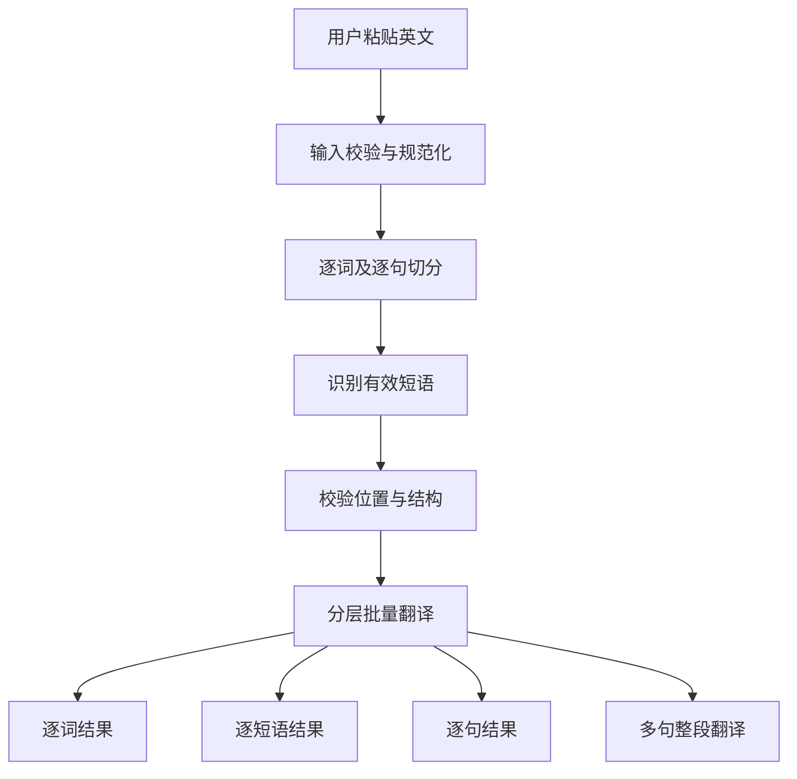

# 英语文本解析与翻译工具技术方案

版本：v2.1  
代码仓库：<https://github.com/chechuan/word-translator>  
计划域名：`translate.cc1204.cn`

## 1. 产品目标

用户粘贴英文内容后，系统自动判断输入类型，并按“单词 → 短语 → 句子 → 整段”四个层级依次翻译：

| 输入类型 | 返回内容 |
| --- | --- |
| 单个单词 | 该单词的中文译义 |
| 一个短语 | 组成短语的每个单词，以及完整短语的中文译义 |
| 一个句子 | 每个单词、识别出的每个有效短语、该句中文译文 |
| 多句段落 | 每个单词、每个有效短语、每个句子的译文，以及整段中文译文 |

所有项目按照原文中的出现顺序展示。每次出现都保留，不因为内容重复而从结果中删除；缓存层可以复用相同内容的翻译。短语中的单词仍然出现在逐词结果中，例如 `call tools` 作为短语出现时，`call` 和 `tools` 也分别翻译。

“逐短语”指抽取原文中的固定搭配、短语动词、习语、技术术语和有独立含义的语法短语，而不是排列原文所有可能的连续单词组合。后者会产生大量没有语言意义的组合。

首版只处理英文到简体中文。输入框支持粘贴文本，不做文档附件、图片 OCR、音标、发音和生词本。

## 2. 页面效果

页面分为输入区和结果区：

1. 输入区：英文文本框、解析并翻译按钮、清空按钮、字符计数。
2. 结果概览：自动识别为“单词”“短语”或“句子/段落”。
3. 逐词翻译：原文中的每个英文单词、所在句子序号、中文译义。
4. 逐短语翻译：每个识别出的有效短语及中文译义。
5. 逐句翻译：按原文顺序显示每个句子及对应中文译文。
6. 整段翻译：将多句内容作为整体翻译成自然的简体中文。
7. 每项提供复制按钮；整段结果提供一键复制。

单个单词只显示逐词结果。短语显示逐词和短语结果；单句显示逐词、短语和逐句结果；包含两句及以上时再显示整段翻译，避免同一译文重复展示。

示例输入：

```text
Agents are applications that plan, call tools, collaborate across specialists, and keep enough state to complete multi-step work.
```

期望结果结构如下，具体译文以实际模型输出为准：

```json
{
  "inputType": "sentence",
  "words": [
    {"source": "Agents", "translation": "智能体", "sentenceIndex": 0},
    {"source": "are", "translation": "是", "sentenceIndex": 0},
    {"source": "applications", "translation": "应用程序", "sentenceIndex": 0},
    {"source": "that", "translation": "用于引导从句", "sentenceIndex": 0}
  ],
  "phrases": [
    {"source": "call tools", "translation": "调用工具"},
    {"source": "multi-step work", "translation": "多步骤工作"}
  ],
  "sentences": [
    {"source": "Agents are applications ...", "translation": "……", "sentenceIndex": 0}
  ],
  "fullTranslation": null
}
```

## 3. 技术选型

| 层级 | 方案 |
| --- | --- |
| 前端与后端 | Next.js + TypeScript |
| UI | Tailwind CSS |
| 模型服务 | SiliconFlow OpenAI 兼容接口 |
| 翻译模型 | 后端变量 `TRANSLATION_MODEL`，初始值 `tencent/Hunyuan-MT-7B` |
| 解析模型 | 后端变量 `ANALYSIS_MODEL`，选择支持 JSON 结构化输出的指令模型 |
| 数据校验 | Zod |
| 缓存与限流 | 首版单实例内存；公开部署建议 Redis |
| 部署 | 首版使用 Vercel Hobby，通过 GitHub 自动部署 |
| 源码 | GitHub Public 仓库，MIT License |

模型名称只属于后端配置，不写进产品名称和 GitHub 仓库简介。腾讯官方将 Hunyuan-MT 定位为文本翻译模型，并给出通用翻译提示模板；它不负责稳定的词法分析和结构化词组抽取，因此解析任务单独处理。[腾讯 Hunyuan-MT 说明](https://github.com/Tencent-Hunyuan/Hunyuan-MT#prompts)

`ANALYSIS_MODEL` 不在代码里写死。部署时从 SiliconFlow 当前可用模型中选择支持结构化输出且成本合适的指令模型，后续可以更换而不改业务代码。

## 4. 整体流程



具体步骤：

1. 去除首尾空白，统一换行符，拒绝空输入和超长请求。
2. 使用英文分词器提取每个单词及字符位置；标点符号保留在原文中，但不作为翻译项目。
3. 使用英文断句器提取每个句子及字符位置。
4. 单个 token 判定为 `word`；多 token 输入由解析层判断 `phrase`、`sentence` 或 `paragraph`。
5. 解析模型抽取全部有效短语，包括固定搭配、短语动词、习语、技术术语和有独立含义的语法短语。
6. 后端验证每个短语都能在原文中找到，丢弃模型虚构内容，并按照原文位置排序；允许不同短语重叠。
7. 将单词、短语、句子按类型分批交给翻译模型；包含两句及以上时，再单独翻译完整原文。
8. 聚合为统一 JSON 返回前端，每个结果保留原文位置和句子序号。

## 5. 抽取规则

逐词翻译会显著增加输出量和模型调用量。首版建议限制为 1,000 个字符或 150 个英文单词，达到稳定性后再提高。

单词和句子由程序确定性切分，推荐使用 `Intl.Segmenter("en")`；运行环境不支持时使用经过测试的英文 tokenizer 和 sentence splitter。解析模型只负责输入类型和短语识别，避免让模型重新生成全部单词和句子。

解析模型必须返回 JSON，不能直接返回 Markdown。每个项目至少包含：

```json
{
  "inputType": "word | phrase | sentence | paragraph",
  "phrases": [
    {"source": "call tools", "start": 35, "end": 45}
  ]
}
```

后端执行以下校验：

- `source` 必须与原文的 `start:end` 完全对应。
- 单词结果保留每一个英文单词、缩写和技术标识，包括 `a`、`the`、`is` 等功能词。
- 标点符号不单独翻译，但其位置保留在句子和整段原文中。
- 短语长度建议为 2–8 个 token。
- 单词最多返回 150 个，短语最多返回 50 个，句子最多返回 20 个。
- 相同单词或短语的每次出现都进入响应；只在调用和缓存阶段合并相同任务。
- 每个结果保存 `start`、`end` 和 `sentenceIndex`，保证页面能对应到原文位置。

解析提示词的核心要求：仅从输入原文抽取，不编造内容；找出所有具有独立含义的短语、固定搭配和技术术语；返回准确字符位置；不负责翻译。

## 6. 翻译调用设计

SiliconFlow 地址为：

```text
POST https://api.siliconflow.cn/v1/chat/completions
```

鉴权头：

```text
Authorization: Bearer <SILICONFLOW_API_KEY>
```

翻译单项时使用腾讯官方通用模板：

```text
把下面的文本翻译成简体中文，不要额外解释。

{source}
```

整段翻译使用相同模板，只把 `{source}` 换成完整原文。初始参数建议：

```json
{
  "stream": false,
  "temperature": 0.7,
  "top_p": 0.6,
  "top_k": 20
}
```

单词或短语使用 `max_tokens: 128`，句子和整段翻译根据输入长度动态设置，上限不直接设为模型窗口上限。[SiliconFlow 对话接口](https://api-docs.siliconflow.cn/docs/api/chat-completions-post)

句子或段落可能包含很多项目，不为每个词无限并发调用。单词建议每批 20 个、短语每批 10 个、句子每批 3 个，以稳定编号交给翻译模型，并校验返回编号是否完整；映射失败的项目再单独补偿一次。包含多句时，完整原文始终单独翻译，避免批量格式影响段落译文质量。服务端并发上限建议为 5。

只有 `finish_reason` 为 `stop` 且译文非空时记为成功；`length` 视为截断。整段译文成功但少数单词、短语或句子失败时，接口返回 `partial` 状态和失败项目，页面仍展示已有结果。

## 7. 接口设计

本站统一接口：

```text
POST /api/analyze-translate
Content-Type: application/json
```

请求：

```json
{"text":"call tools"}
```

响应：

```json
{
  "requestId": "req_xxx",
  "status": "success",
  "inputType": "phrase",
  "words": [
    {"source": "call", "translation": "调用", "start": 0, "end": 4, "sentenceIndex": 0},
    {"source": "tools", "translation": "工具", "start": 5, "end": 10, "sentenceIndex": 0}
  ],
  "phrases": [
    {"source": "call tools", "translation": "调用工具", "start": 0, "end": 10, "sentenceIndex": 0}
  ],
  "sentences": [],
  "fullTranslation": null,
  "warnings": []
}
```

`inputType` 取值为 `word | phrase | sentence | paragraph`，`status` 取值为 `success | partial`。单词、短语和句子分别放入对应数组；只有 `paragraph` 返回 `fullTranslation`，其他类型为 `null`，避免页面重复展示同一译文。

| HTTP 状态 | 场景 |
| --- | --- |
| 400 | 空输入、非英文内容、参数格式错误 |
| 413 | 请求内容超过限制 |
| 429 | 本站或上游限流 |
| 502 | 上游异常、结果无效或被截断 |
| 503 | 密钥、额度或模型配置不可用 |
| 504 | 上游请求超时 |

前端提交新内容时取消旧请求，并用 `requestId` 防止较早响应覆盖最新内容。

## 8. 缓存、限流与费用控制

缓存键包含原文或翻译项哈希、所在句子上下文、任务类型、模型版本、提示词版本和目标语言。单词、短语、句子、完整原文与解析结果分别缓存。相同内容只发起一次上游翻译，但响应仍保留它在原文中的每次出现。成功结果缓存 24 小时，错误不缓存。

公开站点建议：

- 每个访问来源每分钟最多 10 次分析请求。
- 每次最多处理 150 个单词、50 个短语和 20 个句子。
- 每个请求设置模型调用总数上限。
- 记录每日调用次数、输入和输出 token；达到日上限后暂停服务并显示明确提示。
- 不自动切换到未知的付费模型。

用户看到的 RPM 1,000、TPM 80,000 是上游账户或模型当时的速率上限，不等于本站应允许每个访客使用的额度。Hunyuan-MT 在用户页面中标注为“限免”，方案不承诺永久免费。

## 9. 安全设计

真实 API Key 只保存在服务器环境变量：

```env
SILICONFLOW_API_KEY=
TRANSLATION_MODEL=tencent/Hunyuan-MT-7B
ANALYSIS_MODEL=
```

`.env.example` 只保留变量名和空值。`.env`、日志、浏览器请求、Docker 镜像和 Git 历史中不能出现真实密钥。此前在聊天中公开过的密钥应撤销并重新生成。

浏览器不能提交上游地址、API Key 或模型 ID。后端限制请求体大小、上游超时和并发数，不把上游原始错误、请求头或堆栈直接返回访客。

## 10. 仓库结构

```text
word-translator/
├── app/
│   ├── api/analyze-translate/route.ts
│   ├── page.tsx
│   └── globals.css
├── components/
│   ├── input-panel.tsx
│   ├── word-list.tsx
│   ├── phrase-list.tsx
│   ├── sentence-list.tsx
│   └── full-translation.tsx
├── lib/
│   ├── classifier.ts
│   ├── extractor.ts
│   ├── siliconflow.ts
│   ├── translate-batch.ts
│   ├── validation.ts
│   ├── cache.ts
│   └── rate-limit.ts
├── types/translation.ts
├── tests/
├── docs/technical-plan.md
├── .env.example
├── .gitignore
├── README.md
├── LICENSE
└── package.json
```

仓库简介保持：`翻译工具`。README 再说明逐词、逐短语、逐句及整段翻译能力、运行方式、环境变量和“每个部署者使用自己的 API Key”。

## 11. 部署与域名

当前只有阿里云域名，没有云服务器。首版采用 Vercel 托管：GitHub 负责公开源码，Vercel 连接仓库后构建 Next.js、运行页面和后端 API，并在项目设置中保存 `SILICONFLOW_API_KEY` 等环境变量。[Vercel 环境变量文档](https://vercel.com/docs/environment-variables)

Vercel Hobby 当前面向个人项目和小型应用免费提供一定额度，适合作为本项目的首版测试环境；其免费方案限个人非商业用途，超过额度后可能暂停到下一个周期。[Vercel Hobby 方案](https://vercel.com/docs/plans/hobby)

部署流程：

1. 将项目代码推送到 `chechuan/word-translator`。
2. 使用 GitHub 登录 Vercel，导入该仓库。
3. 在 Vercel 项目中配置服务端环境变量并部署。
4. 部署成功后先通过 Vercel 分配的地址验证页面和 API。
5. 在 Vercel 项目 Domains 中添加 `translate.cc1204.cn`。
6. 根据 Vercel 页面给出的实际 DNS 值，在阿里云 DNS 添加主机记录 `translate` 的 CNAME 记录。
7. 等待域名验证和 HTTPS 证书生效。[Vercel 自定义域名文档](https://vercel.com/docs/domains/working-with-domains/add-a-domain)

DNS 记录值必须以 Vercel 当时显示的目标为准，不预先猜测。记录值不包含 `https://`、端口和路径。以后如果转为商业用途、访问量增加，或需要更稳定的中国大陆访问，再迁移到国内云服务器并把 DNS 改为服务器公网 IP。

## 12. 开发顺序

1. 在仓库增加 `docs/technical-plan.md`、项目 README 和环境变量示例。
2. 实现统一接口、输入校验、确定性分词和断句。
3. 接入解析模型，完成短语识别、位置校验及输入类型判断。
4. 增加逐词、逐短语、逐句和整段的分批翻译、并发控制及部分成功处理。
5. 完成前端四层结果区域和请求取消逻辑。
6. 增加缓存、限流、日志和每日调用上限。
7. 通过 Vercel 连接 GitHub 仓库部署，验证后绑定 `translate.cc1204.cn`。

## 13. 验收用例

| 类别 | 输入示例 | 检查重点 |
| --- | --- | --- |
| 单词 | `deploy` | 只显示单词译义 |
| 缩写 | `API` | 保留原文大小写 |
| 短语 | `on the house` | 每个单词和完整短语都有译义 |
| 技术短语 | `rate limiting` | 逐词结果与短语整体语义均正确 |
| 句子 | `The application listens on port 8080.` | 每个单词、有效短语和整句都有译文 |
| 段落 | 两到三句英文 | 每次出现均保留，逐词、逐短语、逐句及整段结果完整 |
| 多义词语境 | 含 `port`、`thread`、`bank` 的句子 | 单项译义与原文语境一致 |
| 异常输入 | 空白、超长文本、中文文本 | 正确拦截并给出可读提示 |
| 上游异常 | 429、密钥失效、超时、截断 | 状态码和页面提示正确 |

重点验证所有英文单词均被保留、抽取短语确实存在于原文、短语不会被拆错、每句都有独立译文、整段译文自然，以及任何浏览器资源中都不包含服务端密钥。

本文件是实施技术方案。模型的抽取和翻译效果需要使用代表性的日常内容与技术文档样例做实际评测，再确定最终提示词、项目数量和批处理大小。
